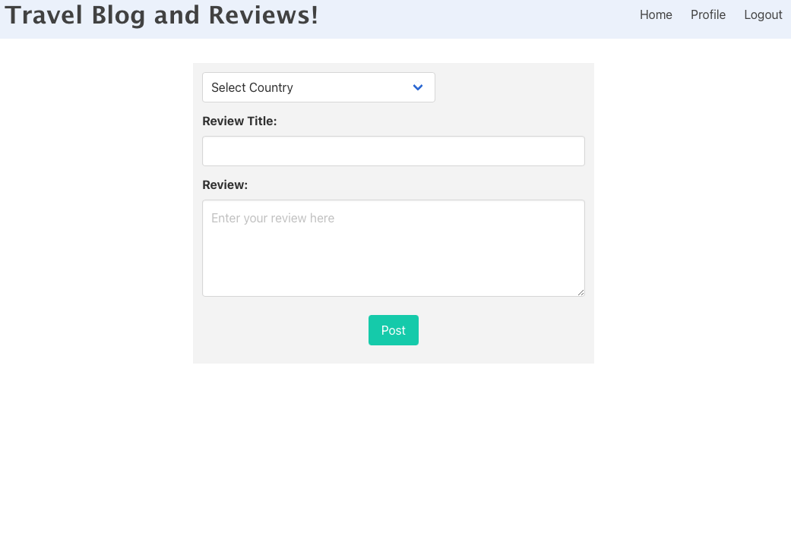

# Travel-blog

This is a simple application that allows users to write travel reviews based on a country. They can then read those reviews at a later time. The user data is saved with sessions and cookiess

## Accessing the application
The code was deployed using Heroku

**URL to Heroku App:**  

**Github Repo:** https://github.com/bckasper/Travel-blog

## Instructions for use
**Below is a detailed breakdown of how this application works:**

1. User lands on the page and then decides to either log in or sign up if they haven't signed in before.

2. The user can then choose to either write reviews or read them.

3. If the user decides to write a review, they will be presented with a form to choose a country, then enter a title and body of their review.

4. If the user decides to read a review, they will see all the reviews that have been posted on the blog (future enhancement to create filters for this)

5. The user can decide to delete reviews they have written on the Read Reviews page
    
6. There is also a Profile page where the user can go and see their user credentials

## Screenshot of Write Review Page
 

## Contributors
This project was developed by Holy Paul, Haley Witherell, Devon Kuhn, and Ben Kasper 

## Technology used in this application
1. This application uses MySQL (https://www.mysql.com)

2. The API routing was created via Express.js (https://expressjs.com)

3. Insomnia to test API methods (GET, POST, PUT, DELETE): (https://insomnia.rest)

4. The app was deployed with Heroku (https://www.heroku.com)